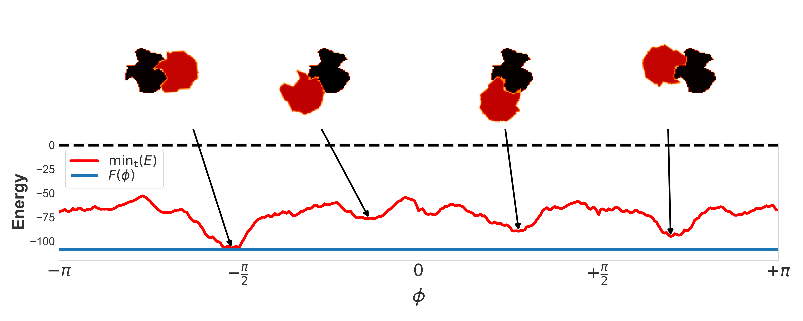
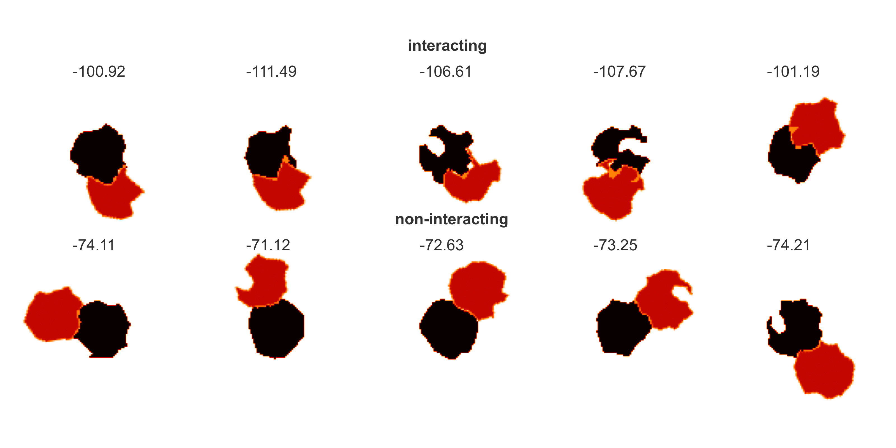

**[Dock2D: Synthetic datasets for the molecular recognition problem](https://arxiv.org/abs/2212.03456)**
-------
This library is used to build a toy protein dataset and models
to solve the tasks for molecular recognition. [See Doc(k)umentation here](https://lamoureux-lab.github.io/Dock2D/).

[comment]: <> ([Examples of interacting vs non-interacting shapes]&#40;docs/source/testset_protein_pool50_interactionsVSnon-interactions.png&#41;)

[comment]: <> ()

[comment]: <> ()

[comment]: <> ([Examples of interacting vs non-interacting shapes]&#40;docs/source/testset_protein_pool50_interactionsVSnon-interactions.png&#41;)

Cite Us
-------

This code is part of the work done in [our paper](https://arxiv.org/abs/2212.03456).
Please cite us if you use this code in your own work:

    @article{Dock2D,
        title={{Dock2D: Synthetic datasets for the molecular recognition problem}},
        author={Bhadra-Lobo, Derevyanko, Lamoureux},
        journal={arXiv preprint arxiv:2212.03456},
        year={2022},
    }
